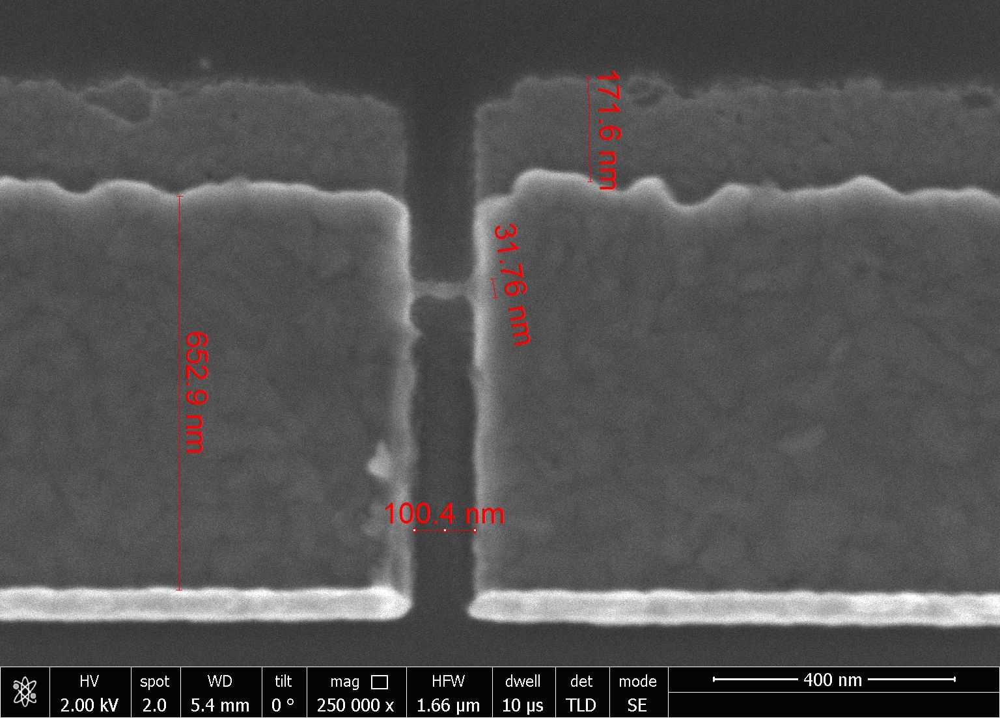
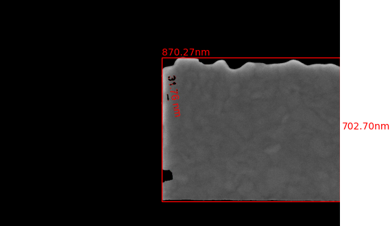
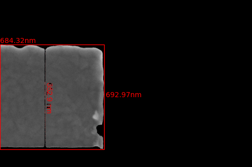
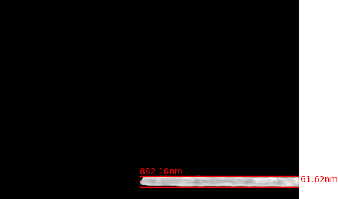
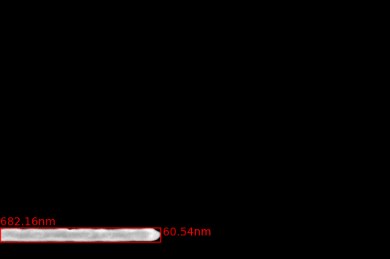

# SEM Image Analyzer

This program is designed to analyze Scanning Electron Microscope (SEM) images, specifically images of superconducting quantum devices. It uses the [Segment Anything library from Meta](segment-anything.com/demo) to identify and segment objects in the image.

## Table of Contents

- [`extract_all_features.py`](#extract_all_features.py)
- [`extract_select_features.py`](#extract_select_features.py)
- [Installation](#installation)
- [Work In Progress](#work-in-progress)
- [Contributing](#contributing)
- [License](#license)

---

## Program Functionality

<details>
<summary><a name="extract_all_features.py"></a>`extract_all_features.py`</summary>

### Features

- Takes an SEM image as input and generates masks for all objects in the image.
- Displays each mask with a bounding box and the dimensions of the bounding box in nanometers.
- Saves each masked image in a directory structure: `results/name of input image/mask#_date created`.
- Extracts the scale from the image and converts it to nanometers, regardless of the original unit.

### How It Works

The program works in several steps:

1. **Input SEM Image**: The user provides an SEM image as input. Here is an example of an input image:

    

2. **Extract Scale**: The program crops the bottom 80 pixels of the image, which contains the scale. It then uses OCR to extract the number and unit of the scale. Here is an example of the extracted scale:

    

3. **Generate Masks**: The program uses the Segment Anything library to generate masks for all objects in the image. It then sorts the masks by area and displays each mask with a bounding box. The dimensions of the bounding box are calculated in nanometers based on the extracted scale.

    Here are examples of the masks generated for the main features in the image:

    
    
    
    
    

4. **Save Images**: The program saves each masked image in the `results/name of input image/` directory. The images are named according to the mask number and the date created.

### Usage

1. Run the program.
2. When prompted, enter the path to the SEM image you want to analyze.
3. The program will generate masks for all objects in the image and save the masked images in the `results/name of input image/` directory.

</details>

<details>
<summary><a name="extract_select_features.py"></a>`extract_select_features.py`</summary>

### Features

- Takes an SEM image as input and generates masks for selected features in the image.
- Allows user to select points on the image to generate masks for specific features.
- Displays each mask with a bounding box and the dimensions of the bounding box in nanometers.
- Saves each masked image in a directory structure: `results/name of input image/mask#_date created`.
- Extracts the scale from the image and converts it to nanometers, regardless of the original unit.

### How It Works

The program works in several steps:

1. **Load the 'Segment Anything' model**: The program loads the model from Meta's Segment Anything library.
2. **Input SEM Image**: The user provides an SEM image as input.
3. **Extract Scale**: The program extracts the scale bar length from the image.
4. **Select Points**: The user selects points on the image.
5. **Generate Masks**: The program generates masks to extract the feature.
6. **Save Images**: The program saves the masked image.

### Usage

1. Run the program.
2. When prompted, enter the path to the SEM image you want to analyze.
3. Enter the pixel scale (default is 370).
4. Enter the number of inputs.
5. The program will generate masks for the selected features in the image and save the masked images in the `results/name of input image/` directory.

</details>

---

<h2><a name="installation"></a>Installation</h2>

1. Install Python 3.7 or later.
2. Download the [checkpoint file from Meta](https://github.com/facebookresearch/segment-anything#model-checkpoints) and store them in the `weights` subdirectory and update the corresponding line in the main file
```python
# Load the model
sam = sam_model_registry["vit_h"](checkpoint="weights/<checkpoint_file_name>")
```

3. Clone this repository to your local machine.
4. Install the required Python libraries. You can do this by running `pip install -r requirements.txt` in your terminal.

## Work In Progress:

- [ ] Dynamic pixel scale extractor
- [ ] Batch Mode Processor with GUI (user clicks on all features of all images)
    - [ ] Feature size statistical analysis (emission file, histograms, tables)
- [ ] Feature recognition in `extract_all_features.py` and statistical analysis
- [ ] Negative mask click implementation

## Contributing

Contributions are welcome. Please open an issue to discuss your ideas or submit a pull request with your changes.

## License

This project is licensed under the MIT License. See the `LICENSE` file for details.
